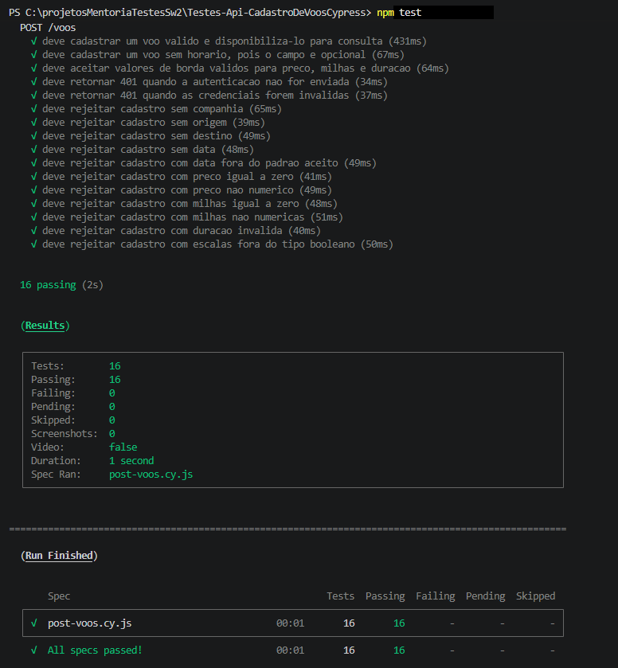

# Flight API Test Automation with Cypress

API test automation portfolio project built with Cypress to validate the `POST /voos` endpoint.

The project highlights a maintainable test structure, reusable custom commands, data-driven validation scenarios, and clear coverage of authentication and business-rule behavior.

Target API:
https://github.com/ricardolagetech/flight-api-tests

## Project Goal

The suite validates flight creation behavior under different conditions, including:

- successful flight creation
- authentication failures
- required field validations
- format validations
- business rule validations

## Setup

This automation project was built against the API repository linked above.

### 1. Clone and start the target API

```bash
git clone https://github.com/ricardolagetech/flight-api-tests.git
cd flight-api-tests
npm install
npm start
```

The API expects Basic Auth credentials. For local execution, create a `.env` file in the API project based on `.env.example` or set the variables before starting the server.

Example for PowerShell:

```powershell
$env:API_BASIC_USER="interno"
$env:API_BASIC_PASS="senha-forte-local"
npm start
```

After the API starts, it should be available at `http://localhost:3000`.

### 2. Configure this Cypress project

This project already includes a sample environment file in `.env.example`:

```env
API_BASE_URL=http://localhost:3000
API_BASIC_USER=interno
API_BASIC_PASS=senha-forte-local
```

If needed, create a local `.env` file in this project with the same values or adjust them to match your API configuration.

### 3. Install dependencies and run the suite

```bash
npm install
npm test
```

## Tech Stack

- Cypress
- Node.js
- dotenv

Note: the test runner structure and assertions used in this project are provided by Cypress.

## Project Structure

```text
test/
  fixtures/
    voos/
  support/
    commands.js
    e2e.js
  voos/
    post-voos.cy.js
cypress.config.js
package.json
README.md
```

### Folder Responsibilities

- `test/voos`
Contains the automated test scenarios for the `POST /voos` endpoint.

- `test/fixtures/voos`
Contains JSON test data files organized by scenario.

- `test/support/commands.js`
Contains reusable Cypress custom commands for authentication and HTTP requests.

- `cypress.config.js`
Defines Cypress configuration, including base URL, fixture folder, and environment variables.

## Test Strategy

The suite was structured to keep a clear separation between:

- test data
- request execution
- response validation

To support that approach, the project uses:

- fixtures to store payloads
- custom commands to reduce duplication
- data-driven validation scenarios for repetitive negative cases

## Custom Commands

### `cy.apiRequest(options)`

A wrapper around `cy.request()` with additional responsibilities:

- validate whether `baseUrl` is configured
- apply valid or invalid authentication
- allow negative response validation through `failOnStatusCode: false`

### `cy.postVooFromFixture(fixtureName, options)`

Loads a flight fixture and sends a `POST /voos` request.

### `cy.getVoos(options)`

Executes a `GET /voos` request to validate previously created records.

## Prerequisites

Before running the tests, make sure you have:

- Node.js installed
- npm installed
- the `flight-api-tests` API running
- valid Basic Auth credentials

## Environment Configuration

This suite uses the following environment variables:

```env
API_BASE_URL=http://localhost:3000
API_BASIC_USER=interno
API_BASIC_PASS=senha-forte-local
```

### Environment Variables Description

- `API_BASE_URL`: base URL of the target API
- `API_BASIC_USER`: Basic Auth username
- `API_BASIC_PASS`: Basic Auth password

If these values are not provided, the project falls back to local default values configured for development and study purposes.

## How to Run

### 1. Install dependencies

```bash
npm install
```

### 2. Run the tests in headless mode

```bash
npm test
```

or

```bash
npm run cy:run
```

### 3. Open Cypress in interactive mode

```bash
npm run cy:open
```

## Current Coverage

At the moment, the suite covers:

- `POST /voos`

Including validation of:

- valid flight creation
- flight creation without the optional `horario` field
- missing authentication
- invalid authentication
- missing required fields
- invalid data types
- invalid formats
- numeric business rule violations

## Visual Evidence

The image below shows a real terminal execution of the suite with all scenarios passing.



## What This Project Demonstrates

This project was built to demonstrate:

- API test automation using Cypress
- separation between test data and test logic
- reusable custom commands
- positive and negative scenario coverage
- maintainable test design
- clear validation of API behavior against expected rules

## Possible Next Steps

Natural extensions for this suite include:

- adding tests for `GET /voos`
- adding tests for `GET /voos/:id`
- adding tests for `PUT /voos/:id`
- adding tests for `DELETE /voos/:id`
- integrating the suite into a CI pipeline
- publishing execution reports

## Author

Ricardo Lage

QA automation portfolio project.